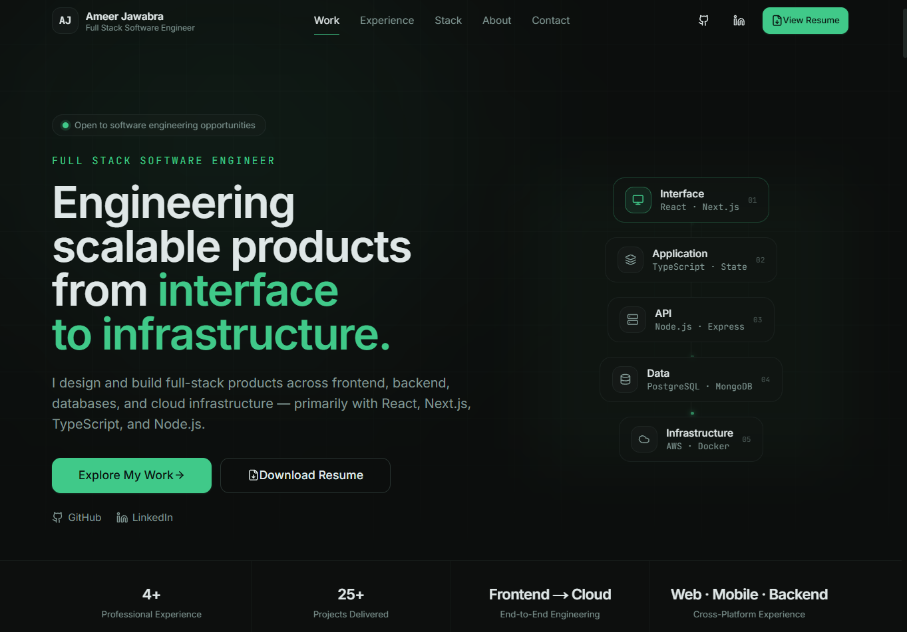
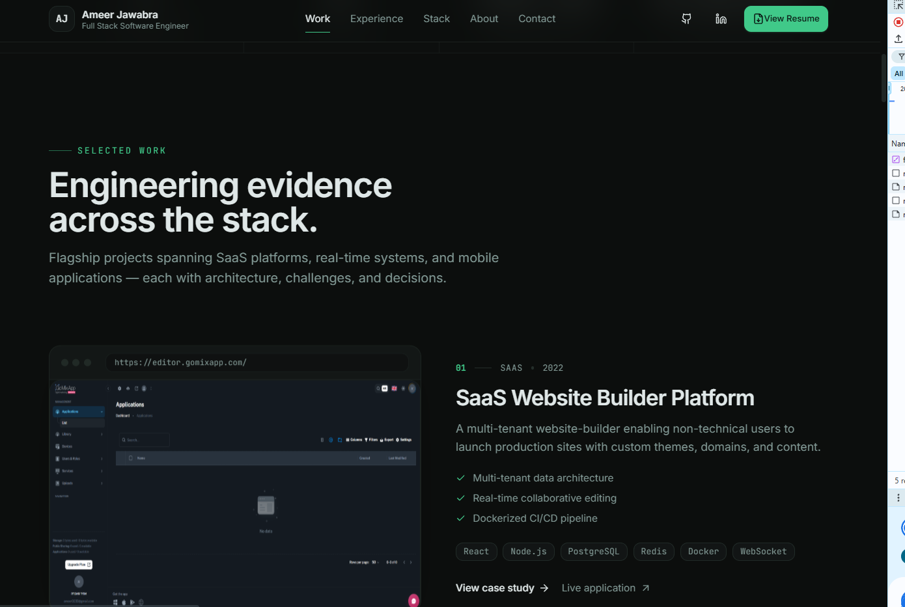
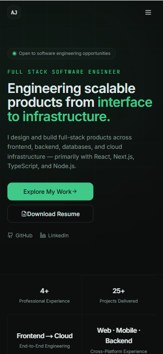

<div align="center">

# 👨‍💻 Ameer Jawabra

### Full Stack Software Engineer — Portfolio

A modern, production-deployed portfolio showcasing my software engineering experience, projects, and technical capabilities.

[](https://ameerjawabra.com)
[](https://github.com/ameerjawa)

</div>

---

## 🖥️ Portfolio Preview

<div align="center">

<a href="https://ameerjawabra.com">
  
</a>

**[→ View Live Portfolio](https://ameerjawabra.com)**

</div>

---

## 🚀 About This Project

This is my personal software engineering portfolio, built as a production web application to showcase my experience, selected projects, technical stack, and approach to building modern software.

The application emphasizes **performance, responsive design, maintainable architecture, reusable components, and production deployment**.

🌐 **Live Application:** [ameerjawabra.com](https://ameerjawabra.com)

---

## ⚡ Tech Stack

### Frontend


### Infrastructure & Deployment


**Architecture:** Next.js · React · TypeScript · OpenNext · Cloudflare Workers

---

## ✨ Features

| Feature | Description |
|---|---|
| 📱 **Responsive UI** | Optimized experience across desktop, tablet, and mobile |
| 🧩 **Component Architecture** | Reusable React components with separation of concerns |
| 💼 **Project Showcase** | Selected engineering projects with technologies and project details |
| 🧑‍💻 **Professional Experience** | Structured presentation of development experience and technical background |
| ✉️ **Contact System** | Server-side contact workflow with validation and email integration |
| 🛡️ **Spam Protection** | Validation and protection for contact submissions |
| ☁️ **Cloud Deployment** | Next.js application deployed using Cloudflare infrastructure |
| 🔍 **SEO** | Metadata and structure designed for discoverability |
| ⚡ **Performance** | Optimized assets and modern Next.js rendering |

---

## 💼 Selected Work

<div align="center">



</div>

The portfolio highlights selected projects across full-stack web development, SaaS applications, mobile development, cloud infrastructure, and production systems.

---

## 📱 Responsive Design

The application was designed to provide a consistent experience across desktop and mobile devices.

<div align="center">



</div>

---

## 🏗️ Project Architecture

```text
ameer-portfolio-2026/
│
├── app/              # Application routes, layouts and pages
├── components/       # Reusable React UI components
├── data/             # Structured portfolio content
├── hooks/            # Custom React hooks
├── lib/              # Shared utilities and application logic
├── public/           # Static assets
├── scripts/          # Build/development utilities
│
├── next.config.js
├── open-next.config.ts
├── tailwind.config.ts
├── tsconfig.json
└── wrangler.toml
```

---

## 🛠️ Local Development

### 1. Clone the repository

```bash
git clone https://github.com/ameerjawa/ameer-portfolio-2026.git
cd ameer-portfolio-2026
```

### 2. Install dependencies

```bash
npm install
```

### 3. Configure Environment Variables

Create a local environment file:

```text
.env.local
```

Add the required environment variables for external services.

> Sensitive credentials and production secrets are intentionally excluded from source control.

### 4. Start the Development Server

```bash
npm run dev
```

Open:

```text
http://localhost:3000
```

---

## ☁️ Deployment

The production application is deployed on **Cloudflare infrastructure** with **OpenNext** providing Next.js compatibility.

Environment-specific configuration and production secrets are managed outside the repository.

🌐 **Production:** [ameerjawabra.com](https://ameerjawabra.com)

---

## 🎯 Engineering Focus

This project demonstrates practical experience with:

- Modern React and Next.js architecture
- Type-safe development with TypeScript
- Responsive UI engineering
- Component-driven development
- Server-side application functionality
- Third-party service integration
- Environment and secrets management
- Cloud deployment
- Production domain configuration

---

<div align="center">

## 👋 Connect With Me

**Ameer Jawabra**  
Full Stack Software Engineer · Ontario, Canada

[Portfolio](https://ameerjawabra.com) • [GitHub](https://github.com/ameerjawa)

---

*Built and maintained by Ameer Jawabra.*

</div>
